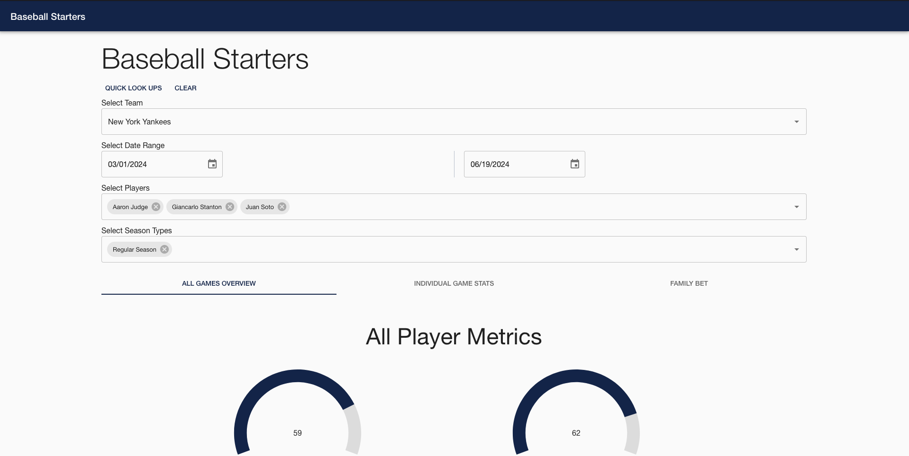

# BaseballStarters

Baseball Starters is a live website that allows users to select an MLB team, identify a date range, choose a group of players, and select the season types. It then calculates how many games the selected group of players all started and how many games they all played (including games where a player was substituted in).

This package was created to help teach me more about CDK and JavaScript.

To visit the site go to [baseballstarters.com](https://baseballstarters.com/)

